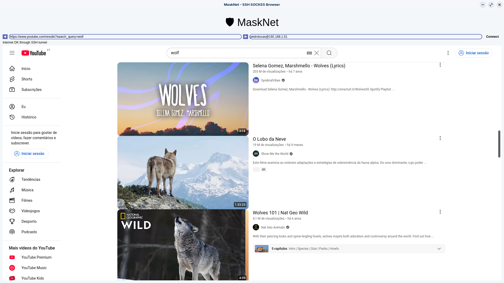
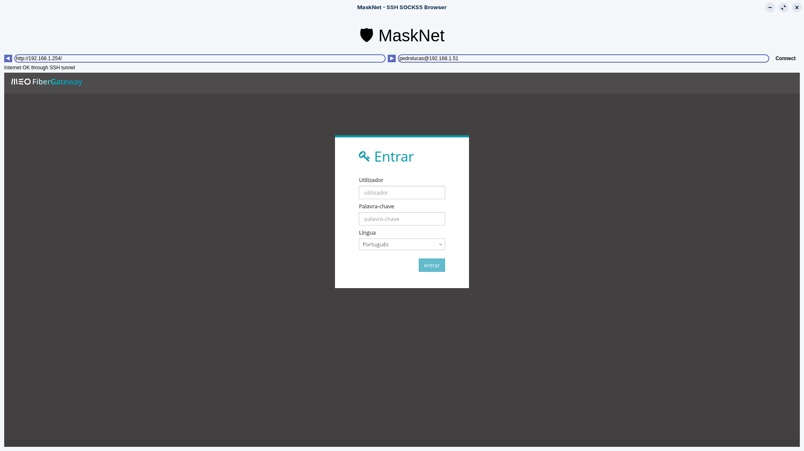

---

# 🛡️ MaskNet

**MaskNet** is a Python-based desktop browser that routes all web traffic through an SSH SOCKS5 proxy. Ideal for privacy enthusiasts, pentesters, or developers working with remote environments. It combines SSH tunneling with a built-in browser to simulate secure, anonymized browsing through a remote server.

---

## ✨ Features

- 🔒 Connect to a remote SSH server via password.
- 🌐 Launches a SOCKS5 proxy on port `1080`.
- 🧭 Built-in browser using PyQt5's `QWebEngineView`.
- 🔄 Live connection status monitoring.
- 📎 Minimal, easy-to-use GUI.

---

## 🎯 Ethical Hacking & Pentesting Objectives

MaskNet can be used in **controlled environments** for security testing, red teaming, and operational stealth. Some practical use cases include:

- 🕵️‍♂️ **Anonymized Browsing**: Route traffic through jump hosts to mask the original IP address.
- 🧪 **Traffic Inspection**: Observe how apps/websites behave when routed through different geographic endpoints.
- 🛠️ **Bypassing Geo-blocks & Filters**: Test how sites behave under different network restrictions.
- 🧑‍💻 **C2 Simulations**: Use the SOCKS proxy to route tools (e.g., `curl`, `nmap`, Metasploit modules) via remote hosts.
- 🔐 **Red Teaming/Phishing Testing**: Safely simulate browser-based access from attacker-controlled infrastructure.
- 🛰️ **Pivoting**: Use the SOCKS5 tunnel to access internal resources when the SSH server is in a segmented network.

> ⚠️ **Disclaimer**: MaskNet is intended strictly for **educational**, **ethical hacking**, or **authorized penetration testing** scenarios. Always have explicit permission before using this tool in any network environment.

---

## 🚀 Installation

### Prerequisites

- Python 3.6+
- An accessible SSH server
- Dependencies:
  - `PyQt5`
  - `sshpass`

### Install

```bash
pip3 install -r requirements.txt
sudo apt install sshpass
```

---

## 🧠 How It Works

1. You enter SSH credentials (e.g. `alice@server.com`).
2. MaskNet creates a dynamic port-forward (SOCKS5 proxy) via SSH.
3. The app sets the browser to use this proxy.
4. You browse the web—traffic is routed securely through your SSH host.

---

## 💻 Usage

```bash
python masknet.py
```

- Enter `user@host` in the input.
- Provide the password when prompted.
- Start browsing via the embedded window.

---

## 🛡️ Security Tips

- Prefer **SSH keys** over password auth.
- Run MaskNet in isolated VMs when testing.
- Avoid using on shared/public systems.

---

## 📸 Preview




MaskNet being used to browse Youtube.com, watching videos and music...

<br>



MaskNet being used to access internet router settings from another network...

---

## 📜 License

MIT License

---

## 🤝 Contributing

PRs are welcome! If you’d like to add features (e.g. SSH key support, Tor integration, multiple proxy profiles), feel free to open an issue or fork the repo.

---

Let me know if you’d like a dark mode, key-based SSH auth, or any other nice features!